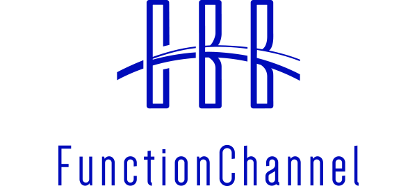
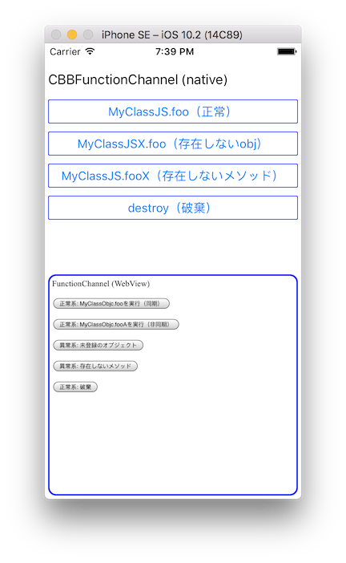

# <p align="center"></p>
FunctionChannel の iOS用の実装を提供します。

## Example
本リポジトリの [Example](Example) ディレクトリが, WKWebView(HTML) と ネイティブコード(Objective-c) 間の FunctionChannel で相互にRPCを実行する簡単なサンプル・プロジェクトになっています。



- Objective-c: [ViewController.m](Example/Example/ViewController.m), [MyClassObjc.m](Example/Example/MyClassObjc.m), [MyClassObjc.h](Example/Example/MyClassObjc.h)
- HTML: [index.html](Example/www/index.html), [script.js](Example/www/script.js), [data-channel.js](Example/www/data-channel.js), [function-channel.js](Example/www/function-channel.js)

Exampleをビルドして動作させる場合, 事前に `pod install` を実行してください。
```
cd Example
pod install
open Example.xcworkspace
```

## Setup 
### Podspec
```
abstract_target 'defaults' do
    pod 'CBBFunctionChannel', '2.0.3'
end
```

## Usage
#### step 1: CBBFunctionChannelの準備
使用するCBBDataChannelインスタンスを指定してCBBFunctionChannelを生成します。

```objective-c
    CBBFunctionChannel* functionChannel = [[CBBFunctionChannel alloc] initWithDataChannel:dataChannel];
```

#### step 2: リモート側から実行できるメソッドを定義したクラスを準備
リモート側から実行できるメソッドは `CBBRemoteExport` を継承したプロトコルとして定義する必要があります。
以下, `MyClassObjc` というクラスにリモート側から実行できる `foo` (同期) と `fooA` (非同期) を定義する例を示します。

- [MyClassObjc.m](Example/Example/MyClassObjc.m)
- [MyClassObjc.h](Example/Example/MyClassObjc.h)

（抜粋）
```objective-c
// プロトコル
@protocol MyClassObjcExport <CBBRemoteExport>
- (NSString*)foo:(id)arg1:(id)arg2:(id)arg3;
- (CBBAsyncResult*)fooA:(id)arg1:(id)arg2:(id)arg3;
@end

// インタフェース定義
@interface MyClassObjc : NSObject <MyClassObjcExport>
@end

// 実装
@implementation MyClassObjc
-(NSString*)foo:(id)arg1 :(id)arg2 :(id)arg3 {
    return [[NSString alloc]initWithFormat:@"%@+%@+%@",arg1,arg2,arg3];
}
-(CBBAsyncResult*)fooA:(id)arg1 :(id)arg2 :(id)arg3 {
    return [CBBAsyncResult create:^(void (^ _Nonnull done)(id _Nonnull)) {
        usleep(3000 * 1000);
        done([[NSString alloc]initWithFormat:@"%@+%@+%@",arg1,arg2,arg3]);
    }];
}
@end
```

非同期メソッドは, 次のように実装してください。

1. 戻り値の型を `CBBAsyncResult*` にする
2. メソッドでは `CBBAsyncResult#create` の戻り値をリターンして処理はコールバックで実装する
3. 処理が正常に完了した時, `done` を呼び出して戻り値を返す

>##### （メソッドの第2引数以降にキーワード付与時の注意点）
> Objective-c では メソッドの第2引数以降にキーワードを付与できます（省略することもできます）が, キーワードを付与した場合, __ラージケース（頭文字を大文字）にしてメソッド名の末尾に追加した名称__ がリモートからinvoke時に指定するメソッド名となります。
>
> 例えば,
```objective-c
-(void)fooWithArg1:(id)a arg2:(id)b;
```
> というメソッドの場合, リモートでinvoke時に指定するメソッド名は `fooWithArg1Arg2` となります。
>
>##### （メソッドの引数型についての注意点）
> - メソッドの引数型は原則 `id` 型にしなければなりません
> - ただし, `NSString*` に限りそのまま指定できます

#### step 3: 準備したクラスの実体をbind
step 2 で準備したクラスの実体を `CBBFunctionChannel#bindWithInstanceId` で登録することで, リモート側からメソッドを呼び出すことができる状態（bind状態）になります。

```objective-c
    [functionChannel bindWithInstanceId:@"MyClassObjc" instance:[[MyClassObjc alloc]init]];
```

> `CBBFunctionChannel#unbindWithInstanceId` でbind状態を解除できます。

#### step 4: リモート側のメソッドを実行
`FunctionChannel#invokeWithInstanceId` でリモート側に `bind` されているオブジェクトのメソッドを実行することができます。

```objective-c
    [_functionChannel invokeWithInstanceId:@"MyClassJS" method:@"foo" arguments:@[@"One", @(2), @"3"] callback:^(NSError * _Nullable error, id  _Nullable result) {
        // 実行に失敗した場合: error にエラー情報が格納される
        // 実行に成功した場合: error が nil になり, result に戻り値が格納される
    }];
```

#### step 5: 破棄
`FunctionChannel#destroy` で破棄できます。

```objective-c
    [functionChannel destroy];
```

> FunctionChannelをdestroyしても下位層（DataChannel, DataBus）のdestroyは行われません。

## License
- Source code, Documents: [MIT](LICENSE)
- Image files: [CC BY 2.1 JP](https://creativecommons.org/licenses/by/2.1/jp/)
